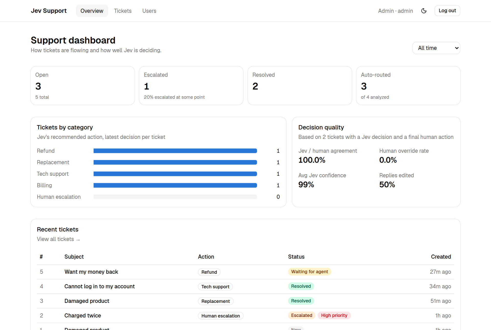
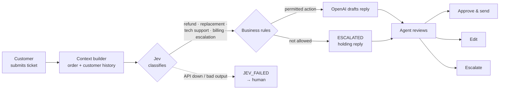
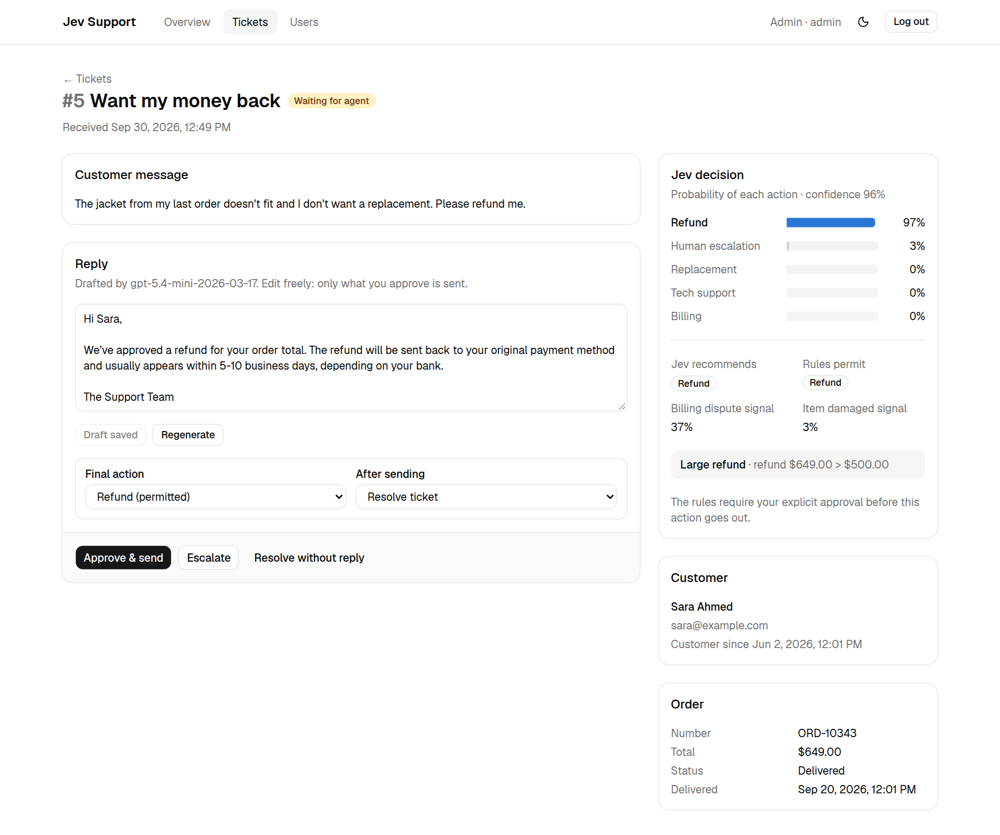
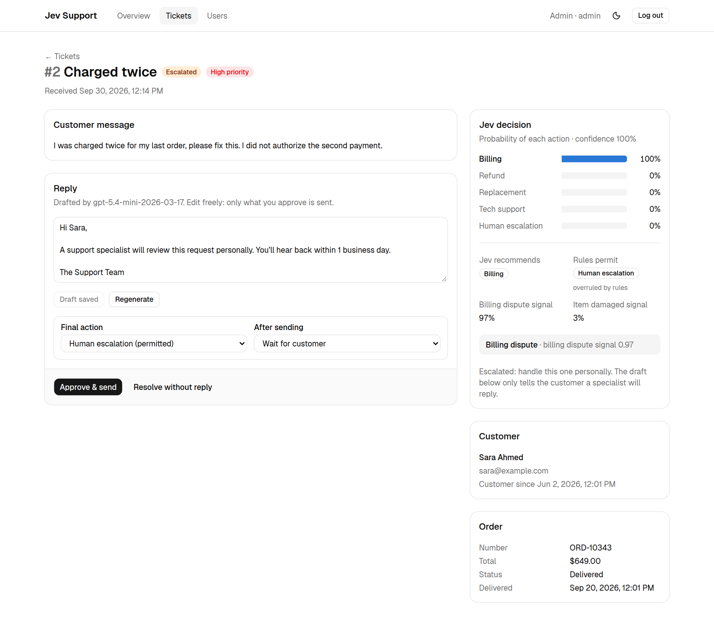
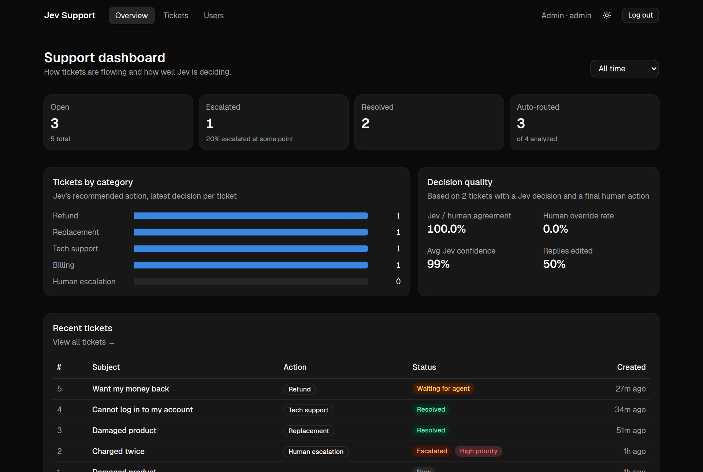
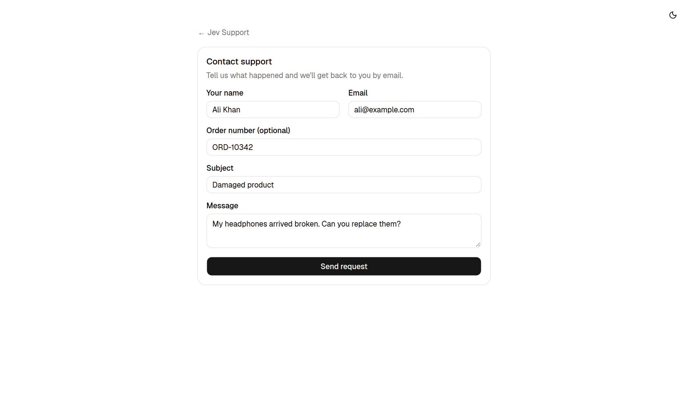
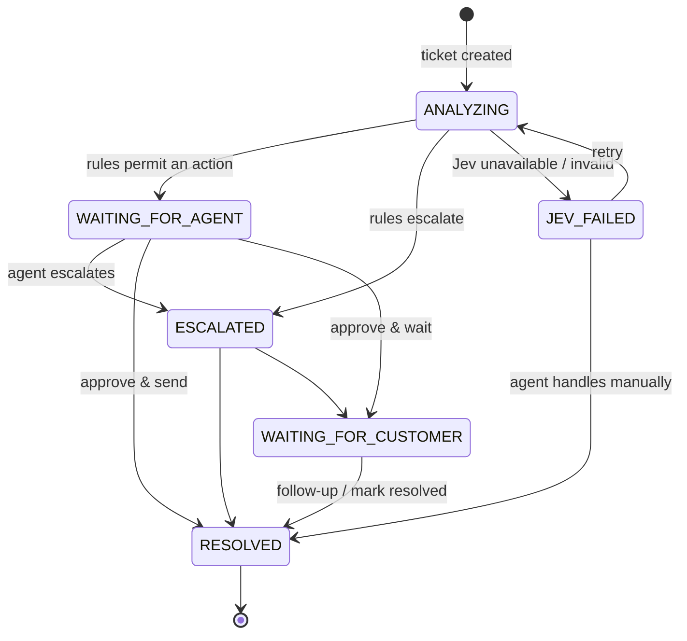

<div align="center">

# Jev Support

**AI-assisted customer support where the AI routes and drafts, and people stay in control.**

Jev decides · rules permit · OpenAI writes · agents approve




</div>

## How it works

A customer submits a request. The backend gathers what it knows about them, asks **Jev** (a typed decision model, via [BeatAPI](https://beatapi.io/jev-api)) which action fits, runs **deterministic business rules** to decide what is actually allowed, then has **OpenAI** draft a reply that states only what was approved. A support agent reviews, edits and sends it.



Each layer has one job, and each can fail without losing the ticket:

| Layer | Job | If it fails |
|---|---|---|
| **Jev** | *Decision:* which of 5 actions fits, with a probability for each | Nothing is guessed. The ticket goes to `JEV_FAILED` for a human |
| **Rules** | *Permission:* what is actually allowed (plain Python, fully unit-tested) | — |
| **OpenAI** | *Communication:* phrase the permitted action, and nothing more | The decision stays saved. The agent writes the reply by hand |
| **Agent** | *Approval:* nothing reaches the customer without a person | — |

## Features

- **Customer support form.** Public, no account needed.
- **Automatic triage.** Every new ticket is classified in the background. Jev also answers two yes/no questions in the same call: *is this a billing dispute?* and *did the item arrive damaged?*
- **Business rules engine.** Rules can escalate, require approval, or pre-approve ([see below](#business-rules)). Thresholds are configurable from `.env`.
- **Grounded AI replies.** OpenAI only sees the permitted action and its policy text. The customer's message is fenced off and treated as data, not instructions.
- **Agent workspace:**
  - Jev's probability bars and which rules fired
  - A reply editor with approve & send, escalate, resolve without reply, follow-ups and retry
  - Overriding the rules is allowed, and recorded
- **Analytics.** Ticket counts, escalation rate, Jev confidence, tickets by category, the **Jev vs human agreement rate**, override rate and reply edit rate.
- **Search** by `#number`, subject, message, customer or order number.
- **Roles.** Agents answer tickets. Admins also manage users.
- **Dark mode.** Follows the OS setting by default, with no flash on load.
- **Audit log.** Every step is recorded: created, analyzed, rule triggered, drafted, approved, escalated, resolved.

<details>
<summary><b>More screenshots</b></summary>

| Ticket detail | Escalated by the rules |
|---|---|
|  |  |

| Dark mode | Customer support form |
|---|---|
|  |  |

</details>

## Quick start

You need **Docker** with Docker Compose, a **BeatAPI key** ([get one](https://beatapi.io/dashboard/apikeys); the free `jev-1.13-free` model works) and an **OpenAI API key**.

```bash
# 1. Configure
cp .env.example .env
#    then set BEATAPI_API_KEY, OPENAI_API_KEY and a random JWT_SECRET:
python3 -c "import secrets; print(secrets.token_urlsafe(48))"

# 2. Start Postgres, the API and the web app (migrations run automatically)
docker compose up -d --build

# 3. Load demo customers and orders, and create your first admin
docker compose exec backend python -m scripts.seed
docker compose exec backend python -m scripts.create_user --name "Admin" --email admin@example.com --role ADMIN
```

| | URL |
|---|---|
| Web app | http://localhost:3000 |
| Customer form | http://localhost:3000/support |
| Agent login | http://localhost:3000/login |
| API docs (Swagger) | http://localhost:8000/docs |

> [!TIP]
> Try the demo orders: `ORD-10342` (Ali, $89.99, delivered 4 days ago) should be pre-approved as a replacement if the item arrived damaged. `ORD-10343` (Sara, $649) triggers the large-refund rule.

## Business rules

The rules run in order after Jev answers. The first escalation wins.

| Rule | Outcome |
|---|---|
| Jev picks `human_escalation`, or confidence / winning probability < **0.70** | Escalate |
| Billing dispute signal ≥ **0.5** | Escalate to a human |
| Refund or replacement with no matching order for this customer | Escalate |
| **3+** refunds in the last 30 days | Escalate |
| Refund over **$500** | Agent approval required (every refund needs approval) |
| Replacement for an undelivered order, or **> 30 days** after delivery | Escalate |
| Damaged item under **$100** | Replacement pre-approved |

The rules live in [`backend/app/services/rules_service.py`](backend/app/services/rules_service.py). The numbers in bold are `RULE_*` settings in `.env`.

> [!IMPORTANT]
> OpenAI may only state what is in [`backend/app/services/policies.py`](backend/app/services/policies.py). The refund, billing and escalation timelines in that file are **placeholders**. Replace them with your real policies before customers see any replies.

## Configuration

All settings come from `.env` (see [`.env.example`](.env.example)).

| Variable | Default | Purpose |
|---|---|---|
| `BEATAPI_API_KEY` | — | Jev access via BeatAPI (**required**) |
| `JEV_MODEL` | `jev-1.13-free` | Use `jev-1.13` (paid) for more than 1 request/minute |
| `OPENAI_API_KEY` | — | Reply drafting (**required**) |
| `OPENAI_MODEL` | `gpt-5.4-mini` | Any chat-completions model |
| `OPENAI_REASONING_EFFORT` | `low` | Leave empty for non-reasoning models such as `gpt-4o-mini` |
| `JWT_SECRET` | `change-me` | Signs login tokens. **Always set a random value** |
| `POSTGRES_USER` / `_PASSWORD` / `_DB` | `jev` / `jev` / `jev_support` | Database credentials |
| `RULE_*` | see above | Business rule thresholds |

> [!NOTE]
> On the free Jev tier, an account that has never been topped up gets **one successful request per minute**. Analysis calls are made one at a time and wait for `Retry-After` on HTTP 429, so tickets queue up rather than fail.

## Ticket lifecycle



## API

Everything is under `/api/v1`. Customers can create tickets without logging in. Every other endpoint needs `Authorization: Bearer <token>` from `POST /auth/login`. Interactive docs are at **`/docs`**.

<details>
<summary><b>Endpoints</b></summary>

| Method | Path | Who | Purpose |
|---|---|---|---|
| `POST` | `/tickets` | public | Submit a ticket (analysis starts automatically) |
| `GET` | `/tickets?status=&q=&limit=&offset=` | agent | List, filter and search |
| `GET` | `/tickets/{id}` | agent | Detail with latest Jev decision and reply |
| `POST` | `/tickets/{id}/analyze` | agent | Re-run Jev + rules |
| `POST` | `/tickets/{id}/generate-response` | agent | New OpenAI draft |
| `PUT` | `/tickets/{id}/response` | agent | Save an edited or hand-written reply |
| `POST` | `/tickets/{id}/approve` | agent | Send the reply and record the final action |
| `POST` | `/tickets/{id}/escalate` | agent | Escalate to a specialist |
| `POST` | `/tickets/{id}/resolve` | agent | Close without sending a reply |
| `PATCH` | `/tickets/{id}` | admin | Raw field correction |
| `GET` | `/customers`, `/customers/{id}[/tickets\|/orders]` | agent | Customer lookups |
| `GET` | `/analytics/overview?since_days=` | agent | Dashboard metrics |
| `POST` | `/auth/login` · `GET /auth/me` | — | Authentication |
| `GET` `POST` `PATCH` | `/users`, `/users/{id}` | admin | User management |

</details>

## Project structure

```text
.
├── backend/                  FastAPI · SQLAlchemy 2 (async) · Alembic · Pytest
│   ├── app/
│   │   ├── api/routes/       thin HTTP handlers
│   │   ├── services/         ticket flow, jev_service, rules_service, openai_service, policies, analytics
│   │   ├── repositories/     database access
│   │   ├── models/           SQLAlchemy tables
│   │   └── schemas/          Pydantic request/response models
│   ├── alembic/versions/     migrations
│   ├── scripts/              seed.py, create_user.py
│   └── tests/                143 tests: fakes for Jev/OpenAI, recorded real BeatAPI fixture
├── frontend/                 Next.js 16 · TypeScript · Tailwind v4 · shadcn/ui
│   ├── app/                  /, /support, /login, /dashboard/{,tickets,tickets/[id],users}
│   ├── components/app/       ticket table, Jev decision card, reply panel, charts
│   └── lib/                  typed API client, auth, theme
├── docs/screenshots/
└── docker-compose.yml        postgres · backend (:8000) · frontend (:3000)
```

All BeatAPI code lives in `jev_service.py`, and all OpenAI code in `openai_service.py`. Each returns a normalized result, so either provider can be swapped without touching the rest of the app.

## Development

```bash
docker compose exec backend pytest                 # backend tests (no real API calls)
docker compose exec backend alembic revision --autogenerate -m "describe change"
cd frontend && npm run lint && npm run build       # frontend checks
docker compose logs -f backend                     # follow the pipeline: jev_*, rule_*, openai_*
```

Both the backend and the frontend reload automatically as you edit.

<details>
<summary><b>Troubleshooting</b></summary>

- **Replies aren't generated and the logs show `OpenAI returned HTTP 401`.** Check `OPENAI_API_KEY`. If you appended a line to `.env`, make sure the previous line ended with a newline, or the two values get joined. After editing `.env`, run `docker compose up -d --force-recreate backend`.
- **Tickets sit in `JEV_FAILED`.** Check `BEATAPI_API_KEY` and the backend logs, then press **Retry analysis** on the ticket.
- **A ticket is stuck in `ANALYZING`.** The backend restarted during analysis. Set its status to `JEV_FAILED` as an admin (`PATCH /tickets/{id}`), then retry.
- **Everyone got logged out.** `JWT_SECRET` changed, so log in again.

</details>

## Roadmap

- [ ] Email delivery of approved replies, and replies from customers back into the ticket
- [ ] Job queue (Redis + worker) for analysis, so restarts never leave tickets stuck in `ANALYZING`
- [ ] httpOnly cookie sessions, rate limiting on public endpoints, production Docker images
- [ ] Frontend end-to-end tests and CI
